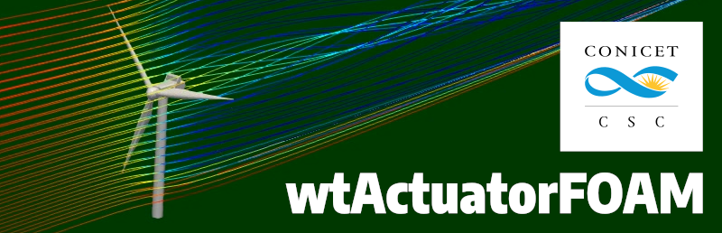

# wtActuatorFOAM

Yet another actuator library to simulate wind turbines in OpenFOAM

Copyright (C) 2025 Computational Simulation Center (CSC-CONICET) - Argentina

## Installation

wtActuatorFOAM was tested on openfoam.com v2412. May work on other versions as well, but not tested yet.

1. clone this repository
        `git clone ...`
2. go to the `wtActuator` directory
        `cd wtActuator`
3. source your OpenFOAM environment
        `source FOAM-DIRECTORY/etc/bashrc` or `of2412` for example
4. run
        `wmake`

## Using **wtActuatorFOAM**

The `wtActuator` class, which represents each turbine, is implemented as an `fvOptions` class in OpenFOAM.

To run a case, you need to add `wtActuator` to the `libs` entry in the `controlDict` file.

Refer to the `fvOptions` folder in the `system` directory of each tutorial case for configuration details. Each `wtActuator` object is associated to a cellSet defined in the `topoSetDict` of the case.

Each tutorial case has an `./Allrun` file with the sequence for running a case.

### Output

There are different levels of information to be outputed by the `wtActuator`. All of them occur at writeTime according to what is defined in the `controlDict` file.

Global information of all the `wtActuator`s in the case are combined in unique files. According to the value set to the `saveLevel` the information reported is:

|    saveLevel  |       Output           |
|:-------------:|----------------------- |
|      0        | no outActuators file   |
|      1        | outActuators.csv file:   `Actuator name, time [s], Uref [m/s], Ud [m/s], Cp, Ct, omega [rad/s], pitch [deg], Power(Uref, Cp) [W], Thrust(Uref, Ct) [N], Torque [Nm]` |  
|      2        | outActuators_extended.csv file (thurst and toque accumulated at nodes):   `Actuator name, time [s], Thrust_actuator [N], Torque_actuator [Nm], Thrust_nodes [N], Torque_nodes [Nm]` |

Additionally when the `saveNodeForces` flag is set `true` a file per `wtActuator` is saved in the `outActuatorsForces` directory with information on each actuator node and `writeTime`:  
        `Actuator name, time [s], node#, r [m], theta [rad], x [m], y [m], z [m], Unode_x [m/s], Unode_y [m/s], Unode_z [m/s],Faero_n [N/m^2], Faero_t [N/m^2]`

### Calibration

Some actuator models (`numeric` and `adaptive`) need an input table with the radial distribution of forces. This table can be constructed running other actuators for diffent combinations of turbine reference wind speed and actual undisturbed wind speed. The option `saveNodeForces` in the `fvOptions` file must be set to `true`.
Then the nodal forces of each combination need to be averaged for each radial position to get the corresponding value in the table.

## Developers

**wtActuatorFOAM** is developed by the Renewable Energy Group at the Computational Simulation Center (CSC-CONICET), Argentina.

Present and past developers:
- Alejandro D. Otero (alejandro.otero@csc.conicet.gov.ar)
- Dimas A. Barile (dimas.barile@csc.conicet.gov.ar)
- Sebastián Santisi
- Juan I. Teich
- Gonzalo Navarro Diaz

