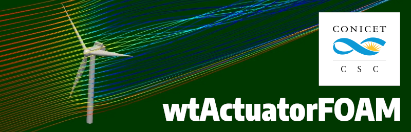
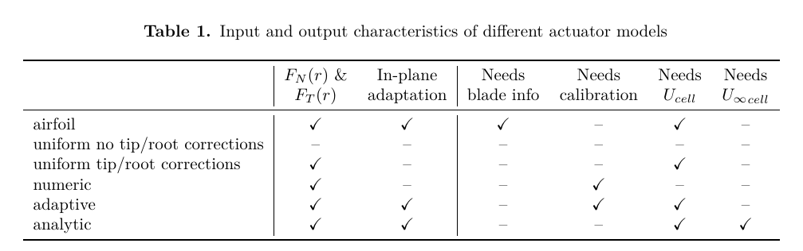

# wtActuatorFOAM

**Yet another actuator library to simulate wind turbines in OpenFOAM**

wtActuatorFOAM is a high-performance actuator library that enables the CFD simulation of thousands of turbines based on OpenFOAM. It was developed with the goal of being easy to install, use and extend, making it suitable for both industrial and research applications.

## Features

### Actuator models

- **`uniform`**: Forces computed according to uniform thrust and torque distributions  (may be corrected by tip/root factors.)

- **`airfoil`**: Forces computed according to the blade element method (needs detailed airfoils information, may be corrected by tip/root factors.)

- **`numeric`**: Forces computed according to the actuator disk model from [van der Laan _et al._ (2015)](http://doi.org/10.1002/we.1816) (needs forces at each radial position for each wind speed.)

- **`adaptive`**: Forces computed according to the actuator disk model from [Navarro Diaz _et al._ (2019)](http://doi.org/10.1016/j.jweia.2018.12.018) (needs forces at each radial position for each wind speed and turbine wind speed reference.)

- **`analytic`**: Forces computed according to the actuator disk model from [Sørensen _et al._ (2020)](http://doi.org/10.1016/j.renene.2019.09.134) (may use tip/root correction factors.)

- **`generalized analytic`**: Forces computed according to the actuator disk model from [Sørensen (2023)](http://doi.org/10.5194/wes-8-1017-2023) (may use tip/root correction factors.)

Some of the characteristics of different actuator models are summarized in the table bellow.

### Meshes
- Rings: actuator nodes arranged in rings, reduce computational cost while preserving accuracy.
- Lines: actuator nodes arranged in lines. Needed for actuator line (AL) simulations.

### Mesh movement
- Fixed actuator meshes.
- Self orienting actuator meshes.
- Rotating actuator meshes:
  - fixed angular speed.
  - variable angular speed from turbine specifications.

### Other festures
- Multiple induction methods.
- Root correction: Glauert and Sorensen methods.
- Tip correction: Prandtl, Glauert and Shen methods (AD.) Variable scaling of smearing factor (AL.)
- Parameterized weighted averaging of disk speed.
- Parameterized nodal force smearing.

## Installation

wtActuatorFOAM was tested on openfoam.com v2412. May work on other versions as well, but not tested yet.

1. clone this repository
        `git clone ...`
2. go to the `wtActuator` directory
        `cd wtActuator`
3. source your OpenFOAM environment
        `source FOAM-DIRECTORY/etc/bashrc` or `of2412` for example
4. run
        `wmake`

## Using **wtActuatorFOAM**

The `wtActuator` class, which represents each turbine, is implemented as an `fvOptions` class in OpenFOAM.

To run a case, you need to add `wtActuator` to the `libs` entry in the `controlDict` file.

Refer to the `fvOptions` folder in the `system` directory of each tutorial case for configuration details. Each `wtActuator` object is associated to a cellSet defined in the `topoSetDict` of the case.

Each tutorial case has `./Allrun_(serial|parallel)` files with the sequence for running a case. The parallel version requires OpenFOAM to be installed with the proper MPI libraries.

### Output

There are different levels of information to be outputed by the `wtActuator`. All of them occur at each writeTime according to what is defined in the `controlDict` file.

Global information of all the `wtActuator`s in the case are combined in unique files. According to the value set to the `saveLevel` the information reported is:

|    saveLevel  |       Output           |
|:-------------:|----------------------- |
|      0        | no outActuators file   |
|      1        | outActuators.csv file:   `Actuator name, time [s], Uref [m/s], Ud [m/s], Cp, Ct, omega [rad/s], pitch [deg], Power(Uref, Cp) [W], Thrust(Uref, Ct) [N], Torque [Nm]` |  
|      2        | outActuators_extended.csv file (thurst and toque accumulated at nodes):   `Actuator name, time [s], Thrust_actuator [N], Torque_actuator [Nm], Thrust_nodes [N], Torque_nodes [Nm], meshRot [rad]` |

Additionally when the `saveNodeForces` flag is set `true` a file per `wtActuator` is saved in the `outActuatorsForces` directory with information on each actuator node and `writeTime`:  
        `Actuator name, time [s], node#, r [m], theta [rad], area [m^2], x [m], y [m], z [m], Unode_x [m/s], Unode_y [m/s], Unode_z [m/s],Faero_n [N/m^2], Faero_t [N/m^2]`

**Note:** the output is produced at each `writeTime`. To produce the output in a tolerance-converged simulation, an additional timestep must be run with the `stopAt writeNow;` option in the `controlDict` file.

### Calibration

Some actuator models (`numeric` and `adaptive`) need an input table with the radial distribution of forces. This table can be constructed running other actuators for diffent combinations of turbine reference wind speed and actual undisturbed wind speed. The option `saveNodeForces` in the `fvOptions` file must be set to `true`.
Then the nodal forces of each combination need to be averaged for each radial position to get the corresponding value in the table.

## Developers

**wtActuatorFOAM** is developed by the Renewable Energy Group at the Computational Simulation Center (CSC-CONICET), Argentina.

Present and past developers:
- Alejandro D. Otero (alejandro.otero@csc.conicet.gov.ar)
- Dimas A. Barile (dimas.barile@csc.conicet.gov.ar)
- Sebastián Santisi
- Fermín Lalanne
- Francisco J. Devereux
- Juan M. Gorza
- Juan I. Teich
- Gonzalo Navarro Diaz

_Copyright (C) 2025-2026 Computational Simulation Center (CSC-CONICET) - Argentina_
